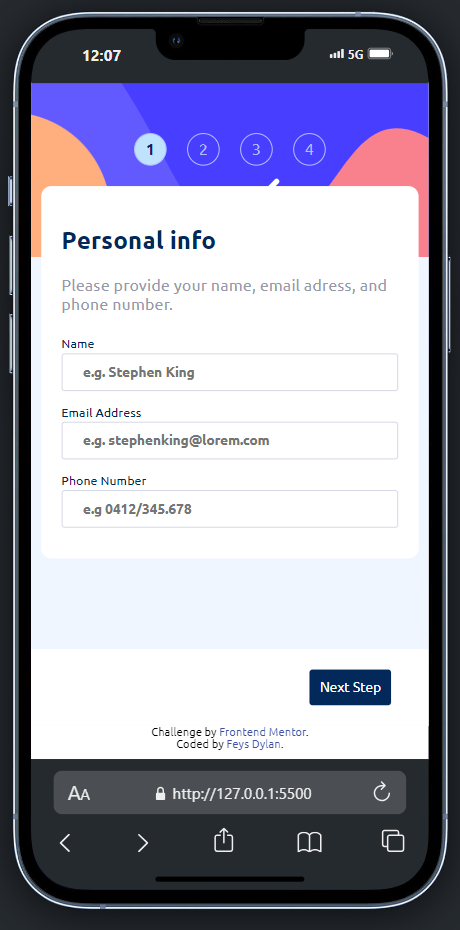

# Frontend Mentor - Multi-step form solution

Ceci est un projet réalisé en side project dans le cadre de mon apprentissage en JavaScript Vanilla. Ce projet est basé sur le [Multi-step form challenge on Frontend Mentor](https://www.frontendmentor.io/challenges/multistep-form-YVAnSdqQBJ).
Fontend Mentor est un site proposant des défis à réaliser pour s'améliorer en front-end.

## Table of contents

- [Overview](#overview)
  - [The challenge](#the-challenge)
  - [Screenshot](#screenshot)
  - [Links](#links)
- [My process](#my-process)
  - [Built with](#built-with)
- [Author](#author)
- [Acknowledgments](#acknowledgments)

## Overview

### Le challenge

Les utilisateurs doivent être capables de

- compléter chaque étape de la séquence
- revenir à une étape précédente pour mettre à jour leurs sélections
- voir un résumé de leurs sélections à la dernière étape et confirmer leur ordre
- visualiser la disposition optimale de l'interface en fonction de la taille de l'écran de leur appareil
- Voir les états de survol et de mise au point de tous les éléments interactifs de la page
- Recevoir des messages de validation de formulaire si
  - un champ a été omis
  - l'adresse électronique n'est pas formatée correctement
  - Une étape est soumise, mais aucune sélection n'a été effectuée.

### Screenshot

### Links

- Live Site URL: [https://happyfeys.github.io/multiStepForm/](https://happyfeys.github.io/multiStepForm/)

## My process

### Built with

- Semantic HTML5 markup
- SCSS
- JavaScript Vanilla
- Flexbox
- Mobile-first workflow

## Author

- Github - [Dylan Feys](https://happyfeys.github.io/multiStepForm/)

## Acknowledgments

